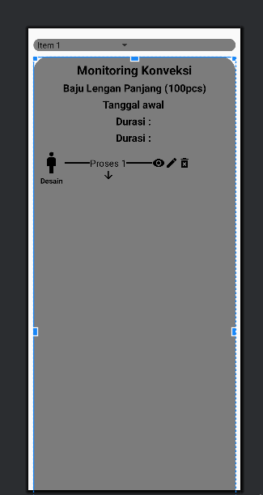

# convection-monitoring-system-at-Tangkelek

This Project is Android And coded with java forr database used MySQL

**USAGE**
* Open Android Folder to Android Studio
* Website Path at xampp and upload to your database
* Use Ngrok for local database server
*Happy To use :)

**FITUR**
- [x] Android And Website
- [x] Actor: Admin, Manajer, Supervisor

**License**
This Script created by Me. I created this just for fun only.

